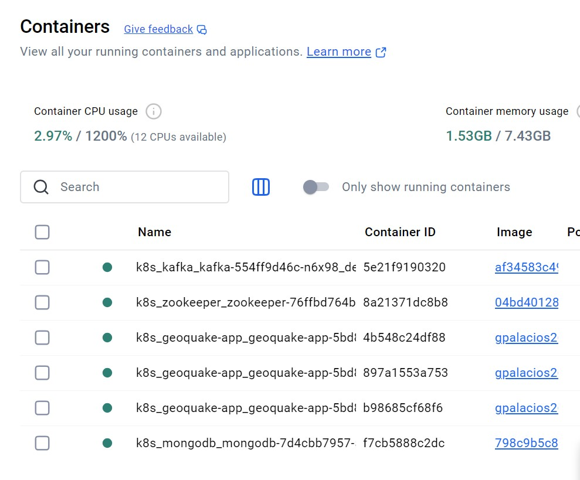
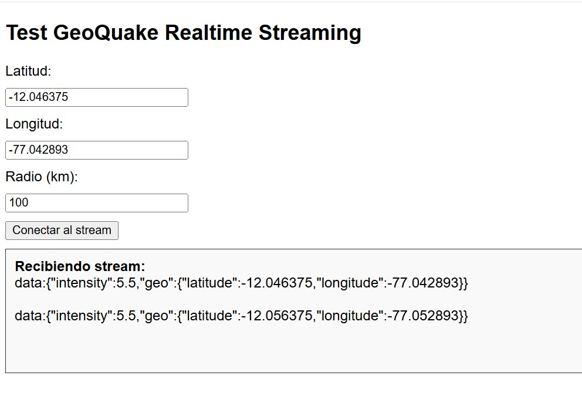
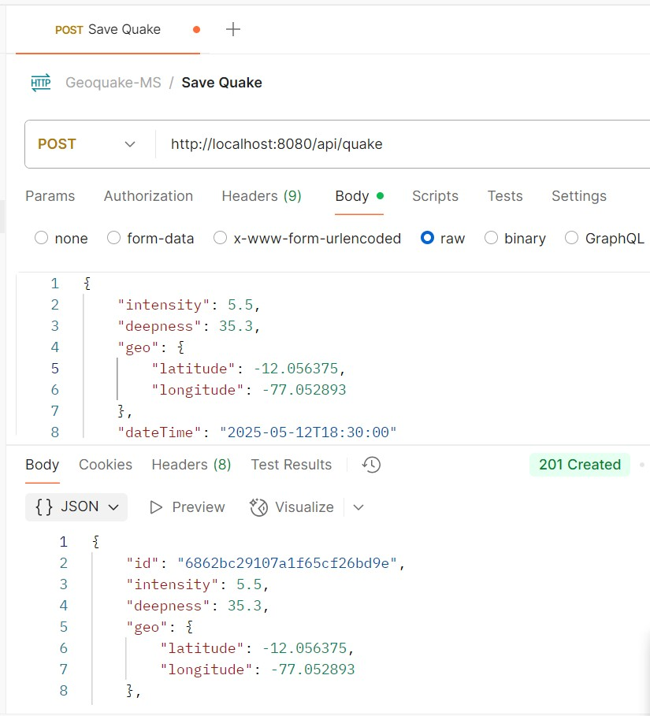

# Code challenge - Ejercicio Lvl 4: Microservicio GeoQuake

Este proyecto es un microsevicio **Java** utilizando **Spring Boot** y **WebFlux** para construir una API reactiva de captura y exposición de movimientos telúricos.

---

## 🚀 Configuración del Proyecto

### 1️⃣ Clonar el repositorio

```bash
git clone https://github.com/gpalacios26/geoquake-ms.git
cd geoquake-ms
```

### 2️⃣ Ejecutar los servicios de mongodb y kafka / Ejecutar la aplicación

Con **Docker**:

```bash
docker compose up -d
```

Con **Maven**:

```bash
mvn spring-boot:run
```

---

## 🌐 Endpoints de la API

Utilizar la colección `Geoquake-MS.postman_collection.json` que se encuentra dentro de la carpeta postman.

---

## 🧪 Ejecución de Pruebas

Para correr las pruebas unitarias:

Con **Maven**:

```bash
mvn clean test
```

Las pruebas utilizan `JUnit 5`, `Mockito` y `WebTestClient` para verificar la funcionalidad de la API.

El reporte de cobertura de pruebas se genera con `Jacoco` en la carpeta `target/site/jacoco/index.html`.

---

## 🌐 Ejecutar la aplicación con Docker Desktop y Kubernetes

```bash
kubectl apply -f k8-deployment.yaml
```







Swagger UI: [http://localhost:8080/swagger-ui.html](http://localhost:8080/swagger-ui.html)

Especificación OpenAPI (en JSON): [http://localhost:8080/v3/api-docs](http://localhost:8080/v3/api-docs)

---

## 📑 Requisitos

- **Java 17** instalado.
- **Maven** configurado.
- IDE recomendado: **IntelliJ IDEA**.
- **Docker Desktop** instalado y configurado (docker compose - kubectl).
